# 阅读舒适度与容量整理 · 2026-10-04

针对用户报告的缩放后笔记短暂消失，已修复一个可复现的画布闪空路径，并安装缩放修复候选。相同测试包在旧02主包上复现放大、缩小两种失败，新主包的这两项及尺寸变化、异步光栅回归共4项通过。真人原手势回测仍待执行。

**真人历史保留：候选02的CF-HW-04为 `FAIL（USER_REPORTED）`，新候选真人复测为 `NOT_RUN`。** 自动化验证覆盖已复现的闪空路径，不能代替原手势、笔感或输入延迟的真人验收。其余4项没有逐项结果，继续记为 `NOT_RUN（结果待确认）`，不因“已测试”推断通过。

阅读界面候选01d的6项定向UI和普通学习流程、容量候选02的12个不同Room方法及4项容量UI结果分别保留。缩放修复没有改动Core/Room输入，本次复用Core 39项、Room 12项历史通过结果，两者本次新增执行均为0。

下面的第一批结论对应明确的安装包，不把其通过结果外推到容量候选，也不覆盖真人报告的问题。候选02容量面板的已记录普通操作和像素已通过核对；最终离线核对确认最初资料、真人新增数据和外部文件保留，并完成新增记录归属检查，结论仅覆盖所捕获快照。核对数据见[验证摘要](verification-summary.json)，图片身份及SHA-256见[图片索引](evidence-index.json)。原10张图片来自修改前基线、01b和01d；新增2张为02普通容量面板，分别显示正常竖屏与1.6字体滚动后的操作区。完整原始回执仍在本机归档。

## 候选与验证身份

设备为 vivo iPA2673，Android 16 / API 36；应用包名 `org.inkweft.app.a0.workspace`，版本68。本轮基于带未提交改动的工作树构建，不能仅以Git提交识别安装内容。

| 对象 | SHA-256 | 用途 |
| --- | --- | --- |
| 当前缩放修复主包 | `7a49c8f07befc7b8b519d5f3a7a24d4472c4c481bf08720f0e22fcd1c052fa8f` | 已安装；可复现闪空路径修复及4项回归 |
| 缩放修复UI测试包 | `f3824e284ed2d9085b2d3c35fcfb6d397bc189561d3e4a1fe09e347ff0706fbc` | 旧/新主包使用同一测试包作红绿对照 |
| 基线主包 | `c12caad57412efe5933f0446d2e56f1aa2ce90ff60c4bc8f9632b6ef34d01079` | 修改前截图及尺寸基线 |
| 候选01b主包 | `35c98f3bdd8c1f4ae4ca41808ab646b08b52238ca6cf9e2697c033fc6d77824c` | 同环境内容区尺寸比较 |
| 候选01d主包 | `3c5b887d58f146628fc87f6e427a228dca498554fa42ea379458bfed8b9469e5` | 第一批最终定向UI、普通流程及真人材料准备 |
| 01d测试包 | `e78a2ea35de41d2023d8f4fe1499d419103f3851dac2fbb7693c59ee417617fa` | 6项运行，5通过、1失败 |
| 01e测试包 | `d8a2f88ff1df82d2d404e1d65de9975c5b379d3532576db7094c286748eb67e3` | 同一01d主包，修正测试高度断言后单项通过 |
| 容量候选02主包 | `714785938f0521e56eacd42d43dfd35c40a3717ecb330817ba3c28e603e6bc12` | 容量改动及第二批实际验证 |
| 候选02 UI测试包 | `8a64fa5ac2c44ae3fadb0781b4d27e36b4233ce77ccbb0b26848720f4c27be29` | 4项容量UI已通过 |
| 候选02 Room测试包 | `3e96950af47e042078709668dd0791129afc0d8540d4d9c592f3973298981e08` | 12个不同方法通过：11无辅助、1初始test host辅助 |

第一批01d构建和静态检查完成，lint为0项Error/Fatal、141项Warning。01e只重建测试包，生产输入逐字节未变；没有把复用的lint算作再次执行。

容量候选02的三个APK均实际重建并用原证书签名，主包仍为版本68；在设备上就地更新，没有卸载或清数据，安装后的三个SHA-256均重新核对。第二批lint实际执行，结果同为0项Error/Fatal、141项Warning。完成回执SHA-256为 `303117f207515eba5971a31fffedd076454f43de79726aa6ce754c4f61cdcea8`。候选02主包文件名为 `InkWeft-comfort-batch02.apk`，以上表中的主包SHA-256核对身份。

缩放修复基于 `eb1dc79`，主包与UI测试包重新构建，沿用原证书和版本68，Room测试包保持候选02身份。此次lint实际执行并通过：0 Error/Fatal、141 Warning。构建回执SHA-256为 `0394462c33127d07ab3861ddcb45851c21e0551ce46f03407ad0eb69b9a4577a`。

## 缩放闪空修复与验证

缩放时，原先按当前视野筛选的笔迹列表会随边缘笔画进出而改变，导致仍可用的旧画面在替换帧完成前被清除。修复让完整稳定笔迹列表保持一致，把不可见笔迹的筛除放到后台绘制；这样等待新帧时仍能显示已有笔迹。生产代码仅改动 `InkCanvasView.kt` 与 `AsyncInkRaster.kt` 两处，共6行新增、2行删除。

| 实际附着屏幕的原生画布检查 | 旧02主包 + 同一新测试包 | 缩放修复主包 + 同一测试包 | 新主包实际辅助 |
| --- | --- | --- | --- |
| 放大时边缘笔画离开视野，可见锚点仍应存在 | REPRODUCED：像素断言复现闪空 | PASS | 一次初始前台拉起 |
| 缩小时边缘笔画进入视野，原可见笔迹应保留 | REPRODUCED：像素断言复现闪空 | PASS | 一次初始前台拉起 |
| 内嵌画布尺寸改变，替换帧前仍有笔迹 | 本轮未对旧包执行 | PASS | 0次；工具允许一次但未触发 |
| 异步绘制保留像素并拒绝过期任务，删除/切除不被旧帧恢复 | 本轮未对旧包执行 | PASS | 0次 |

前两项旧包复现各有一次初始前台辅助；更早一次无辅助放大测试因OEM内核冻结记 `NOT_RUN`，该历史保留。新主包4项中实际2项有辅助、2项无辅助。断言在替换帧发布前检查真实原生View的笔迹像素；没有据此宣称原手指手势已由真人复测、硬件笔感通过或测得输入延迟。

## 11项结果摘要

| 项目 | 当前结果 | 证据范围 |
| --- | --- | --- |
| 1. 既有04b修复 | 折叠/标题位移、首次关联方向、撤销提示沿用已验收实现 | 继承项；没有重记为本轮新修复或新增全量通过 |
| 2. 实际阅读空间 | 同环境纸页和导图内容高度增加，详见尺寸表 | 本轮普通截图及可见原生视图尺寸实测，主包01b |
| 3. 窄分屏大字体 | 187.5 dp / 1.6字体下保留三行、完整标签和48 dp触控目标 | 主包01d普通截图；01d+01e最终6项定向UI |
| 4. 卡片和完整原迹 | 标题正文分区、完整快照缩放与返回流程已核对 | 第一批定向与普通操作；各次失败/重试独立留存 |
| 5. 中文学习流程 | 同份PDF书写、摘录、真实IME、父子整理、回源、复习、重开走通 | 主包01d普通ADB操作，不能替代真人笔感 |
| 6. 真人持笔 | 原02缩放失败记录保留；可复现闪空路径已修复并自动回归通过 | 当前修复候选的真人回测NOT_RUN；其余4项逐项结果待确认 |
| 7. 容量展示 | 自动化计数场景通过；普通文档入口、四项读数和已记录导航核对通过 | 候选02实际UI及普通像素；CF-CP-01/02整体PARTIAL，CF-CP-03普通检查NOT_RUN |
| 8. 阈值与窄屏面板 | 四类80%/满额提示及187.5 dp大字滚动、重试通过 | 候选02两项面板UI，无初始前台辅助 |
| 9. 确定拒绝与草稿 | 满卡拒绝保留真实表单；节点/卡片/快照、复用和复制的相关事务检查通过 | 候选02实际UI和Room；未知结果流程未改作确定失败 |
| 10. 合并恢复与回滚 | 既有库保留、重复恢复、提交前回滚和合并容量专项通过 | 候选02实际Room；合并容量专项经一次初始test host辅助，原受阻记录保留 |
| 11. 构建、资料与交付 | 缩放主包/UI测试包重建，Room包复用；lint及最终离线资料/归属核对通过 | Core39/Room12本次新增执行0；保存检查限于已捕获快照 |

## 阅读界面：留出更多实际内容区

改动收拢了页面和导图上方的重复操作区域，保留常用阅读、书写和返回入口。横屏、竖屏、系统分屏及大字场景均使用同环境前后截图核对；尺寸取自实际可见原生内容视图，排除仍保留在视图树中的隐藏面板。

横屏阅读修改前：

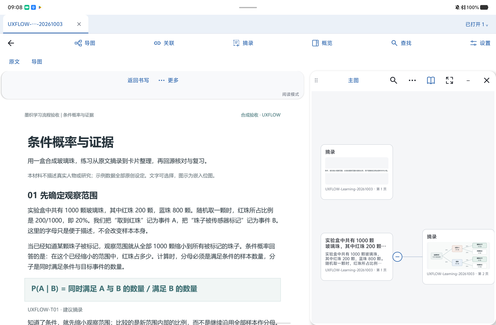

同一尺寸、密度和字体下的候选01b：

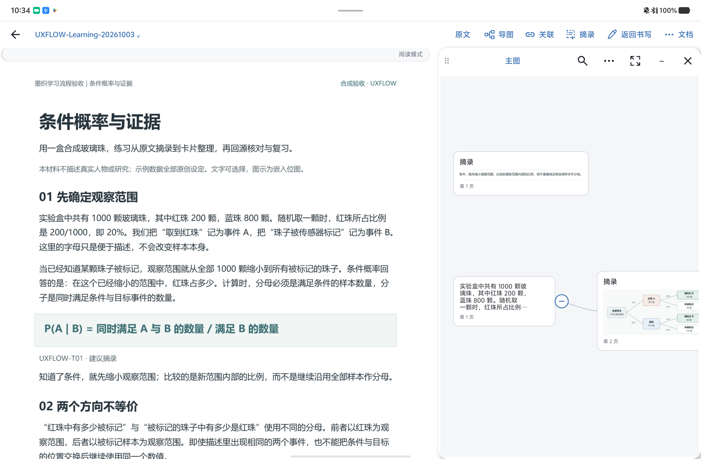

| 同环境比较 | 基线内容高度 | 01b内容高度 | 增加 |
| --- | ---: | ---: | ---: |
| 横屏书写：纸页 | 1723 px | 2011 px | 288 px / 16.72% |
| 横屏书写：导图 | 1819 px | 2107 px | 288 px / 15.83% |
| 横屏阅读：纸页 | 1747 px | 2179 px | 432 px / 24.73% |
| 横屏阅读：导图 | 1819 px | 2107 px | 288 px / 15.83% |
| 竖屏导图 | 3147 px | 3435 px | 288 px / 9.15% |
| 竖屏回源：纸页 | 3075 px | 3507 px | 432 px / 14.05% |
| 系统左侧分屏阅读，字体1.0 | 1747 px | 2035 px | 288 px / 16.49% |
| 系统左侧分屏阅读，字体1.5 | 1696 px | 1999 px | 303 px / 17.87% |

横屏比较为3840×2512 / 480 dpi；竖屏为2512×3840 / 480 dpi；系统左侧分屏宽1911 px。这里量的是可见内容区高度，不能据此推断文字放大、帧率或笔迹延迟改善。

01d进一步处理窄分屏：在750×1600 / 320 dpi、字体1.6、单侧187.5 dp的实际应用分屏中，标题自然增高，常用操作保持三行结构和至少48 dp触控区域。普通操作截图与修正后的定向UI结果均确认标签可达、没有重叠。

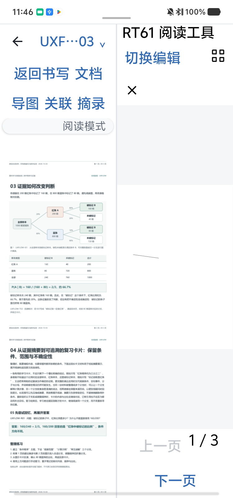

已有摘录的完整原迹查看另行通过普通应用操作核对：选中节点、展开来源、查看保存的完整快照、缩放和平移、返回原卡片，再回到原选中节点。普通手势截图证明流程可用；来源引用与作者记录不变由相应定向UI断言提供，不能由截图单独证明。

## 同份PDF的普通学习流程

材料为同一份三页合成PDF，SHA-256为 `122960d418fb3b17758798579508795048dc4664c7c104af4617f84caafb3c20`。通过普通应用复制并命名为 `COMFORT-Learning-20261004`，在候选01d上完成以下步骤。操作方式为ADB驱动普通应用，没有运行instrumentation；书写为ADB手指轨迹，不属于真人持笔或笔感验证。

1. 打开第1页，绘制两笔，执行撤销与重做。
2. 选择原文段落并创建文字摘录卡，核对长内容的标题和正文显示。
3. 使用vivo中文输入法输入拼音、选取候选，提交标题“条件概率的观察范围”；没有直接注入中文字符串。
4. 创建“样本”子节点，保留父子关系和当前导图位置。
5. 从父卡片回到同份PDF第1页及原笔迹，再返回原节点；既有书写模式得到保留。
6. 打开1卡片、1问题的复习范围，进入隐藏问答，再揭示答案；从本题以只读方式回源，并返回当前问题。
7. 标记本题已理解，结果为1已理解、0待复习、0跳过；返回原父子导图，再从书库重开核对上下文。

真实输入法组合与提交后的中文标题：

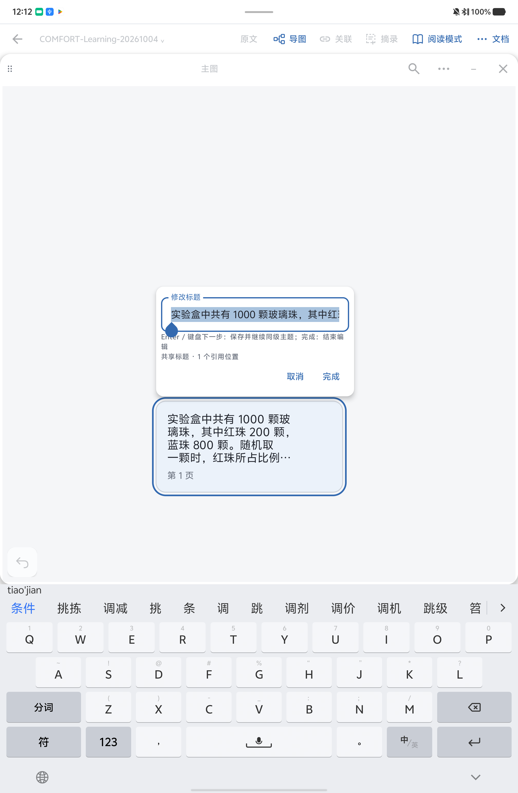

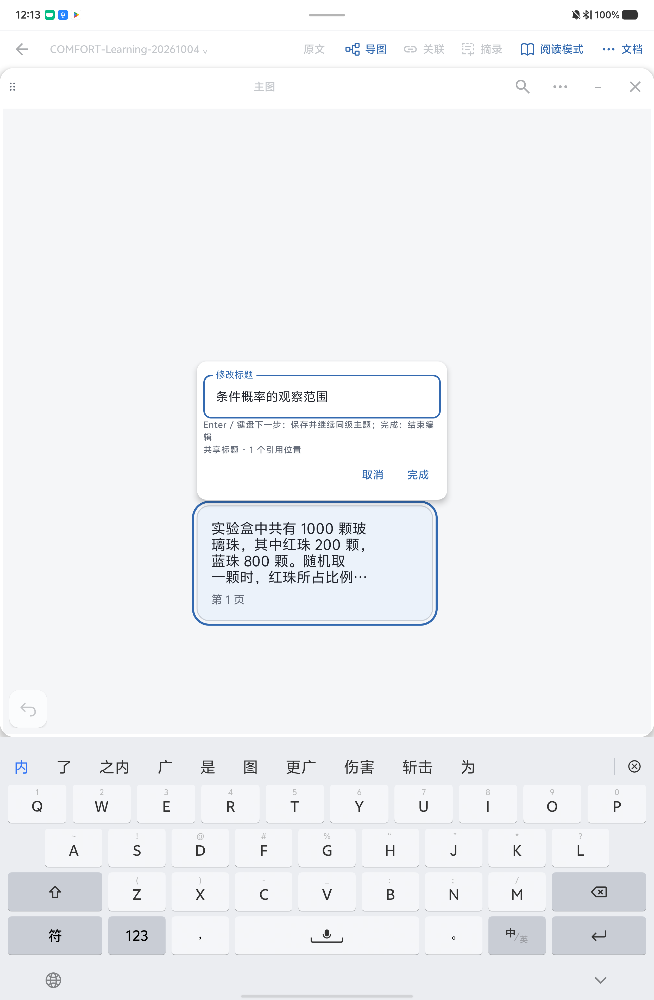

普通应用中整理后的父子节点：

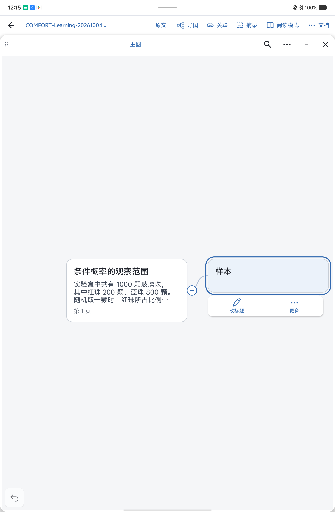

复习中的隐藏问答与揭示答案是两个独立状态；范围选择页没有被当作隐藏问答证据。

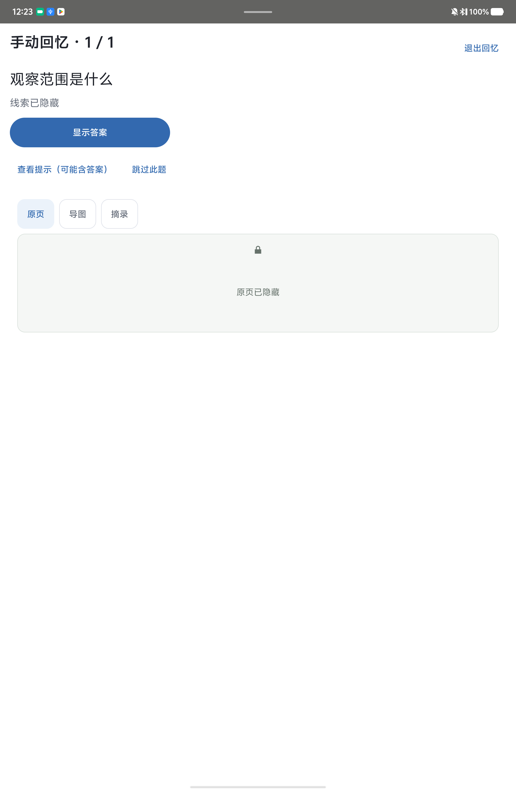

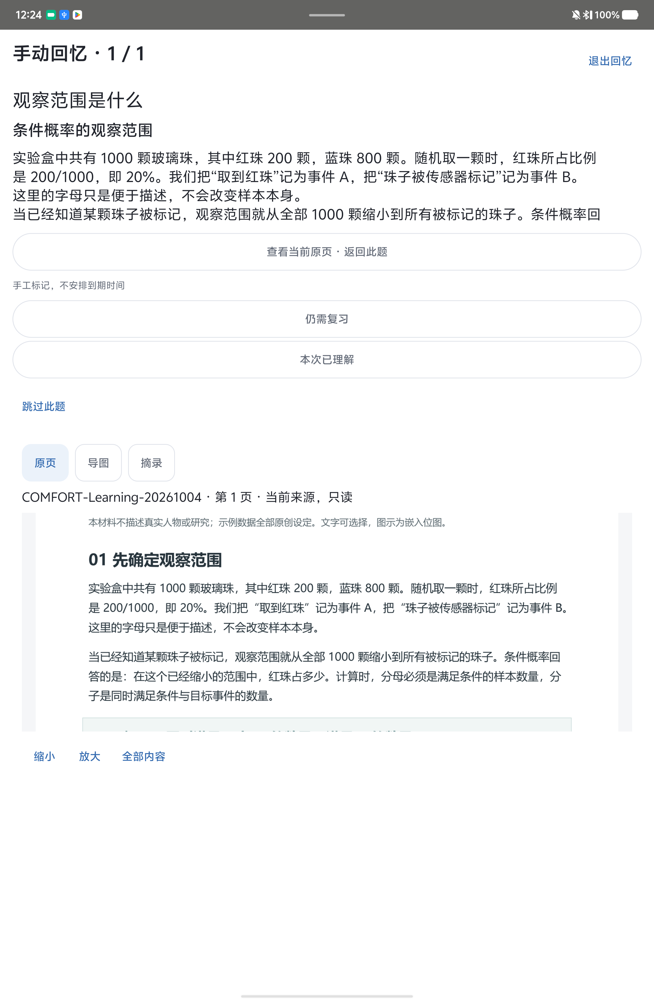

从书库重开后，父子关系和原导图上下文仍可见：

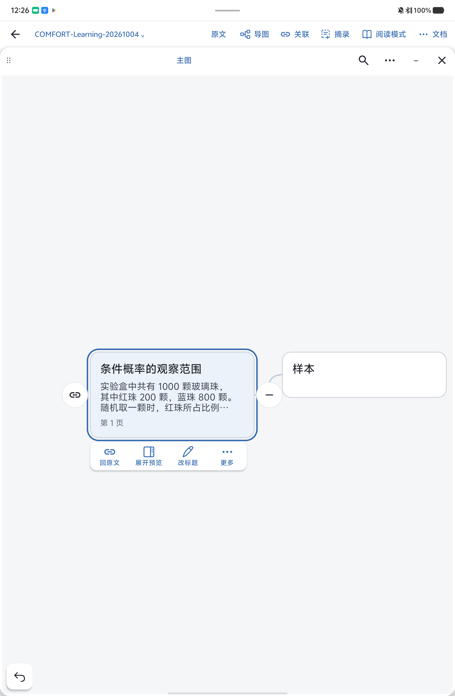

本节只展示已经逐张视觉验收且SHA-256重验通过的关键帧。原始视频尚未完成独立质量核对，继续留在本机，不作为本报告的通过证据。

## 第一批实际运行与历史结果

| 批次 | 实际UI方法数 | 通过 | 失败 | 结论范围 |
| --- | ---: | ---: | ---: | --- |
| 01b | 14 | 10 | 4 | 原始结果保留 |
| 01c测试包 + 同一01b主包 | 4 | 2 | 2 | 定向重试结果，不能累计为新增覆盖 |
| 01d | 6 | 5 | 1 | 窄分屏测试采用固定高度断言，未适配自然增高的标题行 |
| 01e测试包 + 同一01d主包 | 1 | 1 | 0 | 修正高度断言后复验通过 |

因此，同一01d主包最终6个不同的定向方法全部通过；并非在01d上重新运行了01b的全部14项。6项覆盖宽屏阅读与原生笔工具保留、窄屏大字与重建/全屏、连续阅读导航、实际窄分屏操作区、来源页往返，以及双向分屏后来源聚焦。每次instrumentation启动后均有一次初始前台拉起辅助；没有把这些运行描述为完全无人辅助。

更早的01候选在普通打开导图时触发ART `VerifyError`，该候选没有验收通过；01b修复后重新核对了普通首次打开导图。相关失败、拒收截图和原始日志仍保留，未被通过结果覆盖。第一批没有新增Core或Room执行次数；此前317项Core、37项Room等历史记录均未计入本次通过数。

## 容量与整理：实现和验证边界

本批实现一个共用的“容量与整理”面板，可从文档菜单进入，也可从窄屏导图菜单的整理分组进入；低占用时不增加常驻提示行，接近上限时在已有消息区域提示。

| 项目 | 口径与上限 | 80%提示起点 |
| --- | --- | ---: |
| 当前导图有效节点 | 当前导图未移除的位置，包括折叠和视野外节点、结构节点；上限128 | 103 |
| 当前导图全部节点记录 | 包括已移除但仍保留的普通位置；上限256 | 205 |
| 本笔记卡片 | 包括回收区和未放置的卡片；版本不重复计数；上限200 | 160 |
| 全库保存的原迹 | 所有笔记及回收区内编码快照的实际总字节；上限32,000,000 B | 25,600,000 B |

全库原迹使用独立聚合读取，不随每次导图拖动重新读取全部快照。加载中或读取失败显示未知状态，不伪装为0；显示只是提示，事务内的容量判断仍为最终依据。单次摘录和预览图限制分别处理，不与全库32 MB混用。

满额时保留表单草稿，显示具体拒绝原因；结果未知时继续保留原操作的核对/重试流程。备份恢复在写入前检查合并后的全库原迹容量，确定超限时明确告知没有恢复记录；身份冲突和已恢复的幂等分支保持各自含义。

整理建议遵循实际存储口径：复用已有卡片只增加位置；移除普通节点只减少有效节点数；折叠、切换视野、卡片移入回收区及新建导图都不释放全库原迹字节。调整摘录范围只有在重新保存后的编码字节确实变小时才减少全库占用。当前没有永久删除/清空回收区入口，因此面板没有用不存在的功能作承诺。

容量Core已于2026-10-04 12:34–12:35（北京时间）实际运行3类、39项测试，0失败、0错误、0跳过；前后81个输入文件逐字节一致。第二批构建仅在这些输入完全一致时复用该结果，不能再记作39项新执行。

| 第二批检查 | 当前可确认状态 |
| --- | --- |
| Core | 39项实跑通过；复用时核对输入身份 |
| APK、测试包和lint | 三包实际重建、签名及安装身份核对通过；lint 0 Error/Fatal、141 Warning |
| Room | 12个不同方法均通过：11项无辅助，第8项经一次初始test host前台辅助重试通过 |
| UI | 4项实际通过：真实MainActivity两项各一次初始前台辅助，面板两项无辅助 |
| 真机容量面板像素检查 | 已记录的正常竖屏、1.6字体换行及滚动操作区核对通过；普通容量用例仍按实际子步骤记PARTIAL/NOT_RUN |

容量UI实际覆盖真实菜单与计数、隔离的200卡片场景下保留真实编辑草稿、四类阈值，以及187.5 dp / 1.6字体下面板滚动和触控目标。MainActivity两项各在instrumentation启动事件后接受一次初始前台拉起，方法体进入时刻没有独立观测；面板两项没有该辅助。大容量和故障夹具使用隔离数据库，不在用户主资料库制造满额数据。

Room第8项 `legalSnapshotArchivesRejectMergedOverflowAndReplayAtExactCapacity` 首次无辅助执行受OEM内核冻结阻塞，原记录 `NOT_RUN / ENVIRONMENT_BLOCKED_KERNEL_FREEZE` 保留。9～12项随后独立无辅助运行通过；第8项在启动后3.391秒接受一次测试包已有EmptyActivity的前台拉起，取得实际测试终态PASS，耗时8.829秒，没有修改源码或全局freezer设置。最终为12个不同方法通过，其中11项无辅助、1项初始test host辅助；重试不累计为第13个方法。重试回执SHA-256为 `1c09b05d62d65b038544b6f6d8b26e5a5cb2c9642a4ecaea00d92a1697c4444f`。

普通应用操作从“文档 → 容量与整理”进入，读数为有效节点2、全部节点记录2、本笔记卡片2（回收区0）、全库原迹438,671字节；原迹读数与真人后只读备份的离线SQL聚合一致。正常竖屏文字可读，1.6字体下可滚动到四个完整操作标签及关闭按钮。随后实际查看两张已有卡片、空回收区并返回父子导图；未执行普通新建导图、折叠前后计数比较或只读门禁检查。显示设置已恢复到此次检查前值。上述均为普通应用ADB点击/滚动，不是持笔测试。

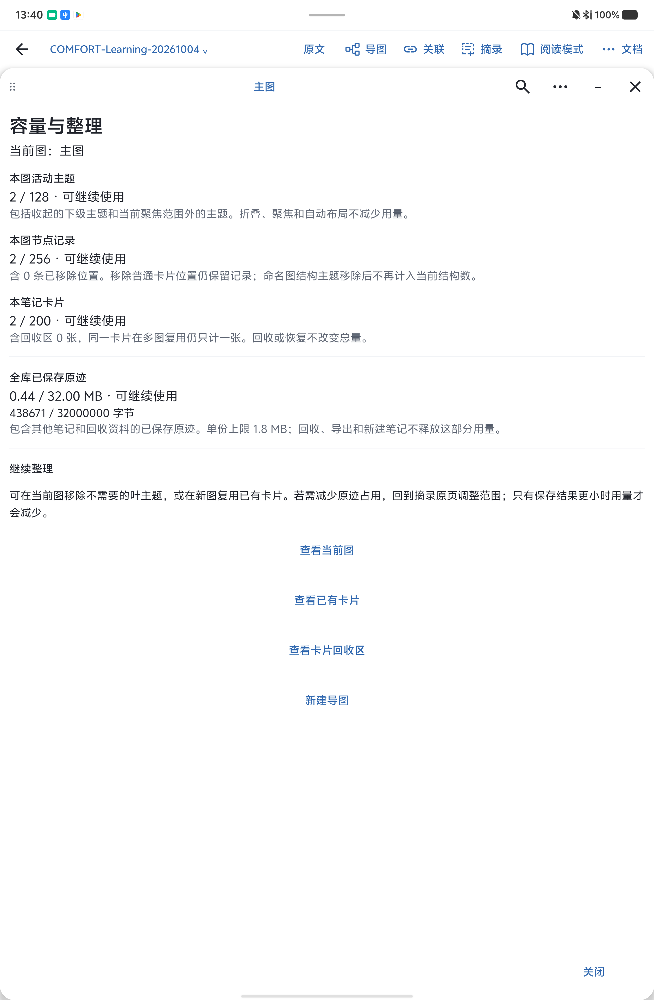

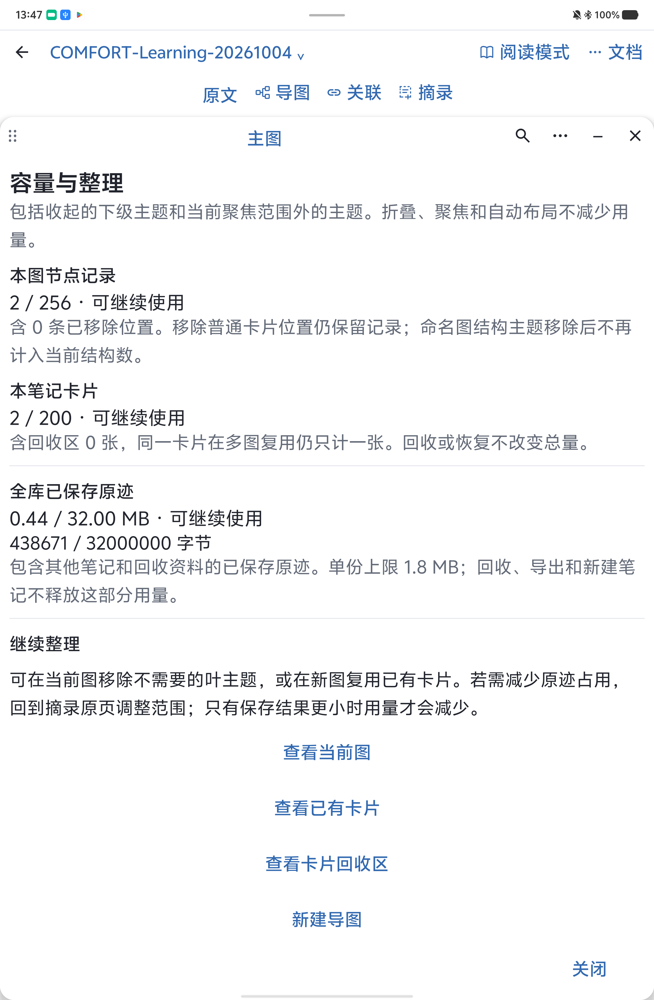

CF-CP-01仅入口、口径和读数子步骤完成，记 `PARTIAL`；CF-CP-02完成大字滚动及卡片/回收区/导图导航，未完成紧凑导图菜单入口等子步骤，记 `PARTIAL`；CF-CP-03普通只读检查保持 `NOT_RUN`。面板像素通过不扩展为这些用例全部通过。

## 真人持笔：修复候选待回测，原失败记录保留

`COMFORT-Learning-20261004`第4页最初为空白测试页，现在已有真人100笔笔迹，应继续完整保留。下图仅为01d准备材料时的历史状态，不代表当前页面。真人随后在候选02报告缩放时笔记短暂消失；具体执行时长、笔型号和原手势细节尚未完整反馈。当前修复候选应在保留现有笔迹的前提下复测，不能清空该页重新制造空白现场。

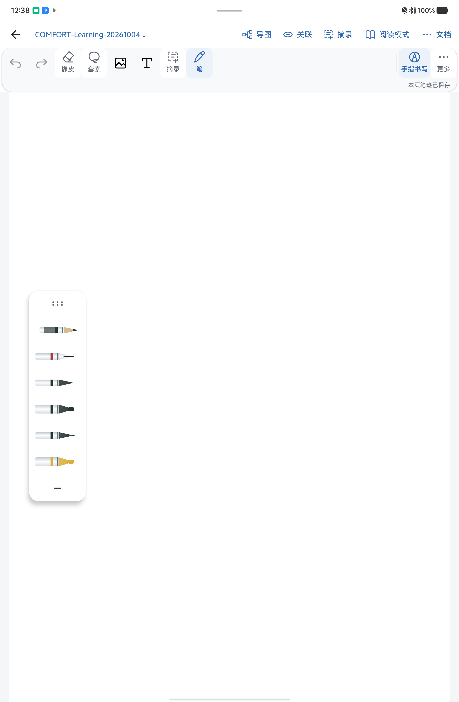

| 用例 | 目标时间 | 内容 | 当前结果 |
| --- | --- | --- | --- |
| CF-HW-01 | 0–2分钟 | 压感观察 | NOT_RUN（逐项结果待确认） |
| CF-HW-02 | 2–4分钟 | 倾斜能力观察 | NOT_RUN（逐项结果待确认） |
| CF-HW-03 | 4–6分钟 | 掌托与误触 | NOT_RUN（逐项结果待确认） |
| CF-HW-04 | 6–8分钟 | 缩放、模式切换与现场恢复 | 历史02：FAIL（USER_REPORTED）；修复候选真人复测：NOT_RUN |
| CF-HW-05 | 8–15分钟 | 连续书写、撤销重做与重开 | NOT_RUN（逐项结果待确认） |

具体准备条件、步骤、预期、结果和证据字段见[设备清单CF-HW-01～05及CF-CP-01～03](../../DEVICE-TEST-CHECKLIST.md)和[结果记录模板](results-template.md)。填写实际起止时间，不以自动化耗时或录像长度替代真人15分钟操作。这里的 `NOT_RUN` 表示尚无该项可确认的执行和结果记录，不断言用户没有做过相关操作。

遇到问题优先使用应用内“文档 → 文档设置 → 诊断与导出”：标记时间、复现并导出ZIP，再补充日志无法表达的操作步骤、视觉或笔感证据。基础诊断包不等于完整系统日志。硬件观察、普通用户检查、备用设备故障测试和未实现能力分别记录。

## 资料保护与归档范围

在第一批真人材料准备前，2026-10-04 12:36左右的核对确认原有13,556条记录保留，新增1,223条记录均归属于识别出的合成测试材料；原有395本笔记均在。外部原有95个文件已恢复核对，没有删除新增用户文件。另一个停止应用的偏好恢复检查点恢复3个原有键，保留19个新增键和10个新增文件；随后普通操作打开COMFORT材料产生的近期/当前页面变化另行记录。

最终审计以三份只读、不可变SQLite快照核对，三份均为29张表且完整性检查通过；快照内外部材料在审计前后哈希一致。最初13,556行、395本笔记的原键原值均保留，缺失0、改动0；真人后到缩放修复后的15,014行新增、丢失、变化均为0。新增1,458行全部解析到39个工作流新本，真人准备前检查点之后仅新增2个容量合成验证本；这项归属核对不构成删除真人内容的授权。

最初95个外部文件全部保持一致；真人后与修复后的106个文件逐文件SHA-256相同，新增11个保留。53个偏好文件共370键中，只有普通容量查看产生的近期浏览键变化，其余369键一致，缺失/新增0，未用旧偏好覆盖真人设置。12项系统设置已恢复基线，仅写回本次改变的屏幕常亮和自动旋转值。以上核对不外推到快照之后的在线状态。

当前已打开新候选的原COMFORT测试页，真人笔迹可见，界面显示“本页笔迹已保存”；对应私人截图和原始数据库、偏好值、诊断日志留在本机。设备上本次328个临时XML已与本地归档逐个比对后清除，过期审查补丁已清理；源码、安装包及最终证据保留。

本次日志检查未发现已确认的写入异常；另有两条无调用栈的资源ID查找错误和较大 `InkPageScreen` 编译尺寸提示，尚无已证实的用户影响，未因此扩大修改范围。

公开材料仅含本报告、汇总信息和已验收的合成材料PNG副本。私人数据库、偏好原值、签名材料、原始PDF及未验收视频保留在本机；原图和回执未被改写。报告与设备清单按实际交付候选同步，保留所有历史结果。
