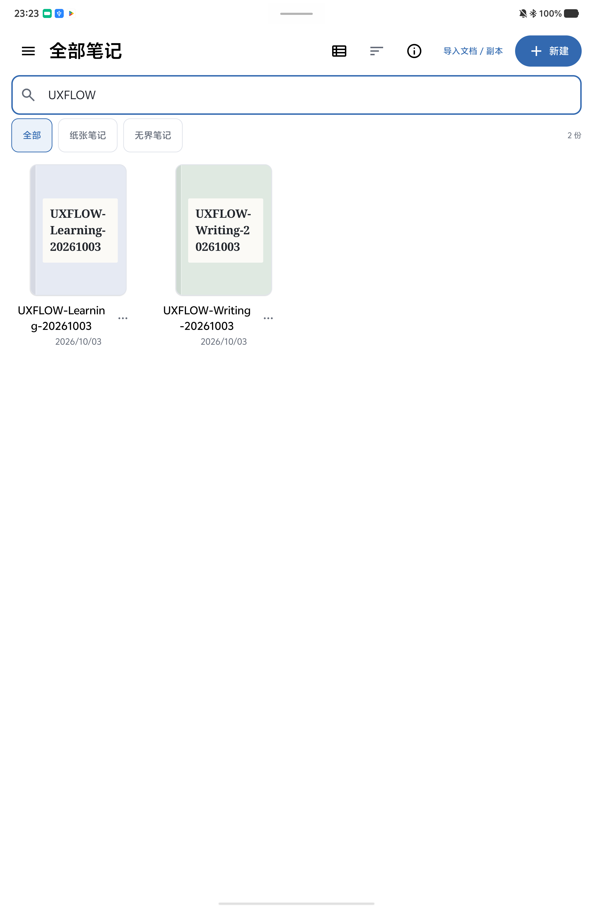
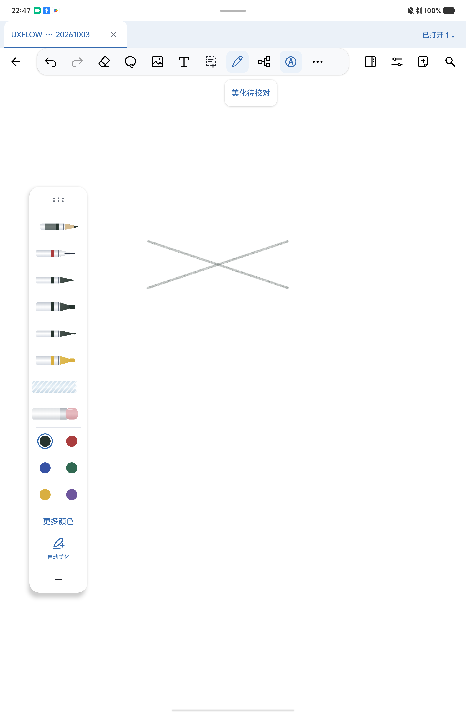
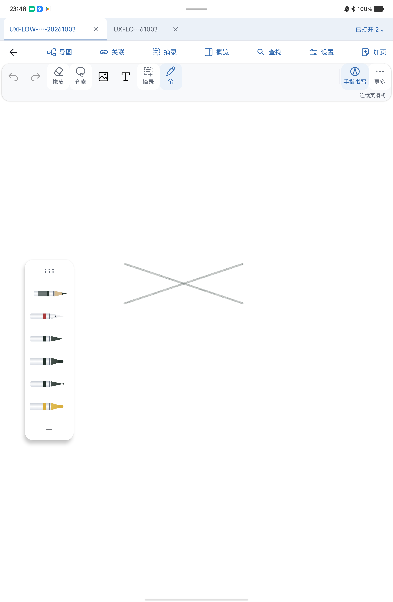
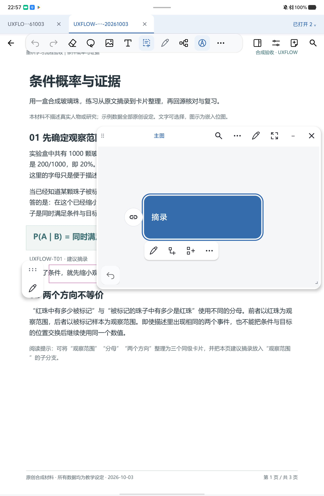
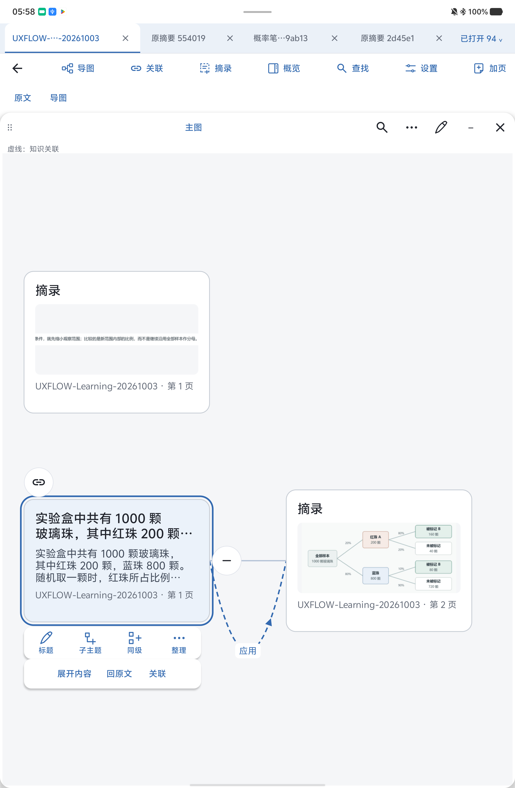
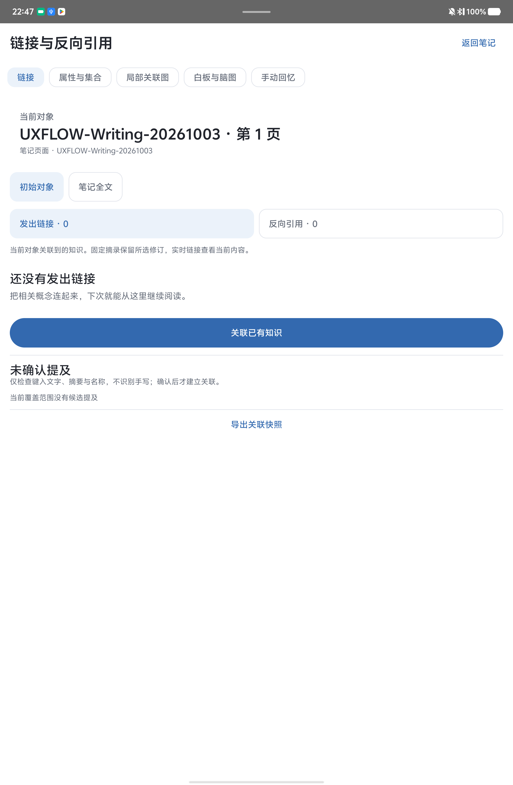
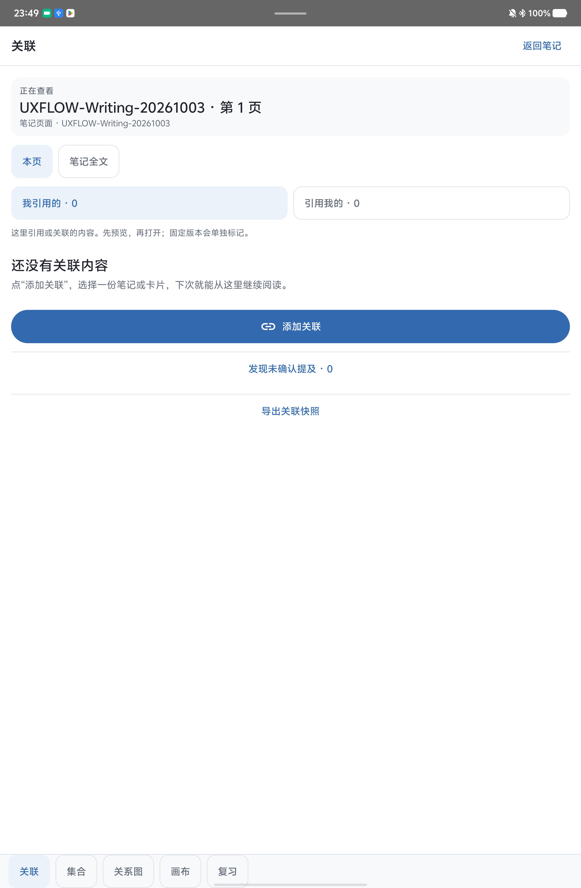

# InkWeft 平板书写、关联与学习导图流程优化

**验收报告，更新于2026-10-04。** 第4批Core全量317 PASS、实体UI26 PASS、全新Room包无辅助37 PASS；lint 141项既有Warning、0 Error／Fatal。同PDF文本卡回忆、图像答案、回源和原位置返回已有47–60截图及两段录屏接受。61／62保留首次方向和折叠布局问题，04b三文件修复已构建安装，lint141项既有Warning、0 Error／Fatal，8项UI全部PASS；普通首次方向、0px折叠稳定布局和撤销提示复验已通过；正常／快速操作与独立零动画录屏均已接受，结论为 **PASS_FOR_RECORDED_SCOPE**。原资料、文件、偏好、12项设置和设备临时清理已核对；真人硬件、精确输入延迟及列明隔离故障待测。

本轮目标是让常用功能容易找到，并把“原文摘录→内容卡片→整理→回源→复习”接成可理解的流程。证据来自指定iQOO实体平板上的合成材料。04 UI使用每方法一次初始前台启动辅助，Room为无辅助instrumentation，普通截图／录屏为ADB操作；真人硬件体验另记。PASS限明确批次与已记录步骤，包装方法数、历史结果与本轮执行分列。

## 设备、源码与已完成04证据

| 项目 | 已核对记录 |
| --- | --- |
| 设备 | 指定iQOO平板；系统属性为vivo iPA2673，Android 16／API 36 |
| 应用 | `org.inkweft.app.a0.workspace`，68／`0.0.68-cloud-candidate` |
| 工作分支 | `codex/local/ux-learning-flow-20261003`；文档版本为随本报告提交的版本 |
| 基点 | `b466ad776424e219796f84dfdd6ff6381c230872`；基点加本地补丁候选 |
| 04完整已跟踪补丁SHA256 | `302bc4d6972ec6c7ad0b5068597d1847b0a5fed776d995c6ebe3797b684a6796` |
| 04 tracked manifest SHA256 | `859aa98007b988d7137193cc7195cd79274a672320fee85a8b5df75c62972eeb` |
| 04 supplemental manifest SHA256 | `ecd71c751884ffca8ad832be1d5971b4a38a74ffa5d1c1f9a69972a8cd285a18` |
| 04 freeze SHA256 | `4105e5c167ea0f6809706e375f5cca0535cb79fb0342bbf2240bc22ac8d18796` |
| 04主包SHA256 | `517364fe37562c8f3d455e56ab39944f75c8b389d9ca353e07cd0e47cb4b7d94` |
| 04 app-test SHA256 | `0421fd0df30be25cbe3c14dd77b31248d5b4ae95558e481d446571af920eb298` |
| 04 Room-test SHA256 | `f3b9ea801f3acc25f654f4ab38005ecb960bbc7102b402ba6b27de24fc4002ca` |
| 签名证书SHA256 | `18e67dbce88152dbe4d4821b5a3a513a409a3df4eac9261f4c11126c36e43969`，原owner证书 |
| 04构建回执 | 安装就绪21:41:20 UTC；最终构建完成2026-10-03 21:52:18.132274 UTC，状态 `BUILD_AND_STATIC_VERIFICATION_COMPLETE`；三包均为新构建 |
| 交付对应 | 随本报告提交的版本；草稿PR链接由最终交付回复提供 |

同为版本68的不同批次必须使用完整APK SHA识别。04实际选择执行的UI26与Room37见后文；构建包内包含63个App验收方法和52个Room验收方法，余下包装方法不计本批通过。

## 04b修复候选：构建、8项UI与普通修复已通过

普通证据61／62发现两处体验问题：仅有出向关系时，范围外入口先落在入向零条；折叠后范围外计数出现，顶部多占102物理像素并使画布下移，已折叠控件仍显示减号。两张历史记录保留PARTIAL。

04b只修改 `KnowledgeWorkspace.kt`、`StudyWorkspace.kt` 和既有 `StudyRelationsUiTest.kt`：首次加载后选择有内容的关系方向，并保存用户后续选择；关系图例和范围外计数固定在同一行，零条时仍保留位置；折叠时显示展开加号。原 `actualToggleAndSelectedOccurrenceChangeOnlyTheReadOnlyOverlay` 方法补充方向、重建、折叠前后位置和返回断言。

| 冻结身份／范围 | 当前记录 |
| --- | --- |
| 04b完整已跟踪补丁SHA256 | `02b71372e7ef42eb646c47cea1d0e1246f486bd65c1a13ef8a74daf74bb64c74` |
| 04b tracked manifest SHA256 | `80d68e0e9cf844131b64aa3da92972a868df1a0facda87fbad106d3b321a42dd` |
| 04b freeze SHA256 | `426dfd968518fb317207d5ee622fee38651f2414ab13ac3be419346444dc577a` |
| 04b主包SHA256 | `c12caad57412efe5933f0446d2e56f1aa2ce90ff60c4bc8f9632b6ef34d01079` |
| 04b app-test SHA256 | `092d96935813a5a5692cf9b42d8a061773795a4946a23d59ff06d100fb338f3d` |
| 构建方式 | UI_ONLY；主包／app-test已重建并安装，Room复用04；最终构建PASS，lint141项既有Warning、0 Error／Fatal，与04相比新增0／移除0；回执SHA `82ff12c1e88b0e105614568e498535919d60ec8f1fa3fe0cfd95278a463a9abd` |
| 保持父04字节的范围 | Core、data、Room测试、构建配置、文档及其余输入；Room APK沿用原04路径与完整SHA |
| Core／Room结果 | 历史04 Core317 PASS／Room37 PASS；04b均为NOT_RUN_REUSED，实际执行0项 |
| 04b UI实际 | 扩展后的actualToggle＋KnowledgeTextLinks7，8 PASS／0 FAIL／0 NOT_RUN；每方法一次初始前台辅助，设置各自恢复；回执SHA `822789f502c99111720b5a11c3b09b91ecc2983f899300bb71b140d83878a483` |
| 普通修复复验 | 63–74对应步骤已接受；64首次出向、65–67折叠0px位移与加号、73撤销旧提示清除均PASS_FOR_RECORDED_STEP |

## 最初五个问题及修改理由

五项问题均来自本轮前态实机画面。参考Goodnotes的导航／书写分层、MarginNote的原文／卡片联动、Obsidian的带上下文反链；复用InkWeft既有Compose、InkTheme和知识／链接能力。

| 编号／优先级 | 观察到的问题及使用影响 | 分批修改与理由 | 已有证据边界 |
| --- | --- | --- | --- |
| UX-01／P1 | 返回、导航、插入和多个书写工具挤在图标横栏，导图／摘录缺少可见中文名称，用户需要猜图标 | 第1批分开导航与书写；“导图、关联、摘录”使用图标＋名称，常用笔、橡皮、套索和撤销保持直接可达 | 笔记编辑前后图确认层级变化；真人笔感另测 |
| UX-02／P1 | 展开笔盒及全部笔参数持续盖住纸面和PDF正文 | 第1批收拢持续占用纸面的笔盒，当前笔颜色／粗细随工具显示，让阅读区域回到主体位置 | 普通应用截图和阅读4项UI覆盖相关路径；不外推所有输入工具 |
| UX-03／P1 | 笔记关联入口绕经设置；面板先展示管理类别和对象说明，方向称呼偏技术化 | 第1批增加可见“关联”，压缩抬头和范围；用“我引用的／引用我的”，条目先预览再打开，管理与移除退出阅读主路径 | 01／01b逐项最新7方法曾通过；04本轮全7方法也已重跑PASS |
| UX-04／P1 | 新摘录节点只有通用“摘录”标题，缺少可辨认内容或页码，整理需要反复打开详情 | 第2批按类型展示文本摘要或图片／手写原貌与出处；长内容默认收起，选中可展开 | 三卡同PDF截图及相关节点方法，文本和源快照各按类型展示 |
| UX-05／P1 | 竖屏导图浮窗盖住原文，阅读与整理争用有限宽度 | 第2批宽屏阅读／导图双栏，窄屏单栏切换；回源短高亮，返回保留节点和视口 | 内部双栏、OEM多窗口和回源分别留证 |

第3批在上述路径上补齐稳定作者顺序、整支缩进／提升／分组、布局预览和撤销。第4批接入按需知识关系、当前卡片回忆与可中断局部反馈，相关自动方法已有本批实机回执；普通同PDF旅程的可见体验仍单独验收。

## 四个核心页面的前后对照

以下图片均选自已接受的合成证据。下列图片为原图副本，复制后已核验SHA256。图注标明各自批次，后续修复画面另附。

### 资料库

| 修改前 | 修改后（第1批） |
| --- | --- |
|  |  |

搜索、新建、导入和打开入口保留。**本页没有本轮可据图确认的视觉改版**，这组用于确认稳定入口。封面长合成标题的断行仍是剩余观察。

### 笔记编辑与书写工具

| 修改前 | 修改后（第1批） |
| --- | --- |
|  |  |

导航与修改纸面的动作分层，导图／关联／摘录直接带中文名称，当前工具参数收敛。旧功能保留可达入口。画面中的笔迹来自自动触屏轨迹，真人笔感留待硬件观察。

### 阅读与学习导图

| 修改前 | 修改后（04知识关系开启） |
| --- | --- |
|  |  |

卡片内容、来源页码和父子关系可辨认；作者顺序与手工位置分开，自动布局先预览再应用。04画面可见选中文本卡的APPLICATION虚线箭头与父子实线分开。03a布局应用状态另留在历史证据中。

补充窗口证据：[应用内横屏双栏](screenshots/landscape-paper-map.png)、[真实系统分屏导图](screenshots/system-split-map.png)、[分屏原文](screenshots/system-split-source.png)、[分屏返回](screenshots/system-split-return.png)。真实IME末项编辑见[03a输入框](screenshots/outline-ime-03a.png)；该图记录普通应用操作。

### 双链关联面板

| 修改前 | 修改后（第1批同页空态） |
| --- | --- |
|  |  |

两图是相同合成页、同为零条关系，主要变化是入口与层级。正式关系仍保留所属笔记、方向、类型、实时／固定版本语义，先只读预览，再重新校验原关系与版本后打开。04范围外关系入口使用显式模式展示各类型入向关系；原反向引用入口保持REFERENCE语义，04相关UI与Room回归已通过。

04关联补充画面已逐张视检并接受：[固定历史](screenshots/links-pinned-history-04.png)、[重建后预览](screenshots/links-recreated-preview-04.png)、[关系已移除](screenshots/links-removed-link-04.png)、[同名目标选择](screenshots/links-same-name-choice-04.png)、[375dp／字号1.6预览](screenshots/links-narrow-preview-04.png)、[375dp／字号1.6选择器](screenshots/links-narrow-picker-04.png)。这六张来自本批实体instrumentation窗口。

## 同一份PDF的动作与证据

验收材料为原创三页合成PDF `UX-Learning-20261003.pdf`，SHA256 `122960d418fb3b17758798579508795048dc4664c7c104af4617f84caafb3c20`。文字、数值、图表和问题均为本轮合成。下表按同材料接续动作，并保留每段所属批次。

| 阶段 | 已有实际证据 | 当前结论 |
| --- | --- | --- |
| 导入／阅读 | 前态已导入三页PDF；后续同一材料持续使用 | 对应观察PASS，47已记录04同材料重开 |
| 摘录／内容卡片 | 区域原貌、文字和图表卡，保留出处；02d／03a三卡画面 | 对应观察PASS；04图51／53已观察B卡多行长中文正文，另有大字体、长标题与真实IME证据 |
| 调整顺序／分组 | 03a普通应用上移、撤销、缩进及重开；[整理动作](screenshots/organize-actions-03a.png)、[父子关系](screenshots/outline-parent-child-03a.png) | 已录动作PASS；未录下移、提升、移入、导出子步骤为NOT_RUN |
| 折叠／展开／重开 | [收起分支](screenshots/collapsed-branch-03a.png)、[重开大纲](screenshots/outline-reopened-03a.png)，同一选中图表卡保留父级 | 对应观察PASS |
| 布局预览／取消／应用／撤销 | [手工位置](screenshots/manual-positions-03a.png)→[预览](screenshots/layout-preview-03a.png)→[应用](screenshots/map-after-03a.png)→[撤销](screenshots/layout-undo-partial-03a.png)→[再次应用重开](screenshots/layout-reopened-03a.png) | 03功能段与图45历史PARTIAL保留；04b的70–74完成新普通复验，73旧提示已清除 |
| 回原文／返回 | 02d实际PDF先出现再短高亮；04从揭答打开同PDF第1页全页只读来源，再返回同题 | 02d原段、04截图53／54及V-04-SCOPE-SOURCE对应观察PASS；C卡第2页见图60 |
| 按需知识关联 | 同PDF重开默认关闭；选中文本卡后显示APPLICATION虚线箭头，与父子实线分开；47／48 | 对应普通观察PASS；61／62历史PARTIAL保留；04b图64及65–67对应修复已通过普通复验 |
| 当前卡片／分支复习 | 当前文本卡1卡2题，文本分支含图表子卡为2卡3题；普通第一题隐藏→揭答→全页回源→标记→第二题重新隐藏→结束 | 49–56及已接受录屏对应观察PASS；结算1理解、1待复习、0跳过。59／60确认C卡图像答案可读并回到同PDF第2页 |
| 返回原详情／节点及最终收口 | 57回原文本卡详情，58回原选中节点／视口；与48比较，排除顶部114px系统状态栏后应用像素完全一致 | 普通返回观察PASS；同PDF合成对象回执另确认3卡／3节点／3来源原值不变。04b普通修复已复验；正常／快速与零动画视频均已接受，终态保护与恢复清理通过 |

04普通主链截图47–60来自同一主包与同一合成PDF：

[47 默认关闭](screenshots/map-default-off-04.png) → [48 APPLICATION关系](screenshots/map-relations-04.png) → [49 当前卡范围](screenshots/review-card-scope-04.png)／[50 分支范围](screenshots/review-branch-scope-04.png) → [51 原详情](screenshots/review-card-details-before-04.png) → [52 首题隐藏](screenshots/review-first-hidden-04.png) → [53 揭答与PDF上下文](screenshots/review-revealed-context-04.png) → [54 全页回源](screenshots/review-source-page-04.png) → [55 次题重新隐藏](screenshots/review-next-hidden-04.png) → [56 结算](screenshots/review-ended-04.png) → [57 原详情](screenshots/review-card-details-returned-04.png) → [58 原图位置](screenshots/review-map-returned-04.png)；C卡另见[59 原迹图像答案](screenshots/review-image-answer-04.png) → [60 同PDF第2页](screenshots/review-image-source-page2-04.png)。

04回忆结束时的合成对象回执确认：3张卡片、3个节点和3份来源的原值不变，其余既有知识记录不变。明确标记只更新B卡两道问题，各自revision由1到2，状态分别为UNDERSTOOD和REVIEW；C卡图像题仍为REVIEW／revision1，未评分。揭答、查看来源和返回属于只读步骤。回执SHA256为 `eca8d3aa38a0ffda77c522f7effa1c17d6787f062b6b04fe4e3cc3e80f49d3d7`。手工回忆保留当前轮次固定问答，未实现SRS到期调度。

两段04录屏和6＋4张原生时间戳帧已接受为PASS_FOR_RECORDED_REVIEW_STEPS，与47–60静态图衔接。两段03a录屏也保留已接受结果。原视频留本机供本地播放；公开稿提供哈希、时序、帧核验与静态图。

| 证据ID | SHA256／时序 | 支持范围 |
| --- | --- | --- |
| V-03-ORG | `3895c5f0ab973edcd5967722d53f6e9cc0be0dc322ff8ecd34f956e18f16ee46`；wall 90.516s，295解码帧，last PTS 79.426s，8张抽帧 | 上移6.000s、撤销11.547s、缩进16.484s、折叠22.047s、展开27.547s、重开32.594s。最后目标38.4s取到实际PTS79.397s |
| V-03-LAYOUT | `1c2fa61e9663aaaf1cfe6e6ca3d10b04f4e6692aeb7045ff4f4f076de8763a79`；wall 90.578s，288解码帧，last PTS 38.109s，8张抽帧 | 取消3.000s、应用13.515s、撤销19.109s、再应用29.625s、重开34.625s；保留旧提示限制 |
| V-04-SCOPE-SOURCE | `cda8c364879c00711a142f76ff1d19d7768860d382a6f2325e5692da91aef4cc`；wall 180.469s，392解码帧，last PTS 164.492s，6张原生帧 | PASS_FOR_RECORDED_REVIEW_STEPS：当前卡2题／分支3题、原详情、首题隐藏、揭答和同PDF第1页来源 |
| V-04-RETURN | `5afe5cc870c5eb6e29c69332420a60f46b4e3b763629e3bd0694dd45089e0283`；wall 90.500s，114解码帧，last PTS 80.021s，4张原生帧 | PASS_FOR_RECORDED_REVIEW_STEPS：回同题、明确理解标记、次题隐藏、待复习标记、结算及原详情／原图返回 |

录制wall与原生解码PTS分别记录；可变帧率不按假定FPS换算。04两段视频支持所录回忆与返回步骤；SR-16正常、快速中断和系统零动画另行观察。下面10张帧已逐张视检、原文件SHA核验通过。

| 对应步骤图号 | 实际原生PTS | 已接受静态帧 | 帧SHA256 |
| --- | --- | --- | --- |
| 49 | 17.227s | [原生帧](screenshots/review-native-49-04.png) | `c84475a4609cfddc87a2d8379db06d939b2245a3a1e8acc9b26fcb7837949dff` |
| 50 | 49.108s | [原生帧](screenshots/review-native-50-04.png) | `5f395af8ba832d3021031a1d272c7eac9ff8fa3927fe92c89a71bf8f5448d3a3` |
| 51 | 76.358s | [原生帧](screenshots/review-native-51-04.png) | `d811d1ac6f1aa2c577743b9bb30747ff76c17111559c71627f8cab5aeef6b6fd` |
| 52 | 111.327s | [原生帧](screenshots/review-native-52-04.png) | `ec15f5cf7ce4675c4969c7aec2e0df858a09cab788a4119043b160701ade32e4` |
| 53 | 132.208s | [原生帧](screenshots/review-native-53-04.png) | `9d995787b95f72c1f144d33914cbd75cfd56fc10afc8a64ea197dd9100369283` |
| 54 | 164.492s | [原生帧](screenshots/review-native-54-04.png) | `879b9814051a215ba612d60e8a1d97d9f0d0b25e8ea0d1d6a43b7792f2fdaedb` |
| 55 | 20.856s | [原生帧](screenshots/review-native-55-04.png) | `601df08c58565d781cf2d2ab6bbce0a85868edf46006d2c26cb782f2236d7ac4` |
| 56 | 43.257s | [原生帧](screenshots/review-native-56-04.png) | `e2ef7569fd9bce4467303f1067a4c951ea03fe4956451886df1fe9e3af6f7db6` |
| 57 | 61.772s | [原生帧](screenshots/review-native-57-04.png) | `a041e374b5bec2a604aba7c5a111a46794d58fe5ca22633e08c17cda82ad378e` |
| 58 | 80.021s | [原生帧](screenshots/review-native-58-04.png) | `d6fe5b29773bf70ba63d3d87315aaad389a9934bf7e268ada677fd39c5943cab` |

04普通补充问题图：[61 首次落在入向零条](screenshots/outside-direction-partial-04.png)、[62 折叠后顶部增高102px且加号缺失](screenshots/fold-layout-partial-04.png)。两项保留历史PARTIAL，04b的64和65–67已追加普通修复PASS。

## 04b普通复验与历史问题收口

同一合成PDF的63–74普通应用ADB步骤已接受。64直接显示出向1条；65→66→67的范围外计数为0→1→0，折叠时为加号。回执核对三态画布和折叠控件bounds完全相同，垂直位移 **0px**，此前62的102px下移已在04b普通复验关闭。61／62原问题图及PARTIAL历史记录仍保留。

70先显式上移C卡建立手动偏移，71预览、72应用、73撤销，74再次应用后关闭重开。73恢复手动位置与原视口，旧“布局已提交”文字已清除，关闭图45的旧提示问题。布局操作造成C节点revision变化，最终id／parent／xy一致；最终同PDF合成对象回执已确认：3卡、3来源、6条知识记录与9条历史修订逐值不变；3节点的id／card／parent／xy保持，仅C节点revision从5到9，对应这四次明确操作。04回忆后的题目状态保持，回执SHA `d1ad13dbd1b2078b42b8e52a3f5af72dc1ccc7dd78b2faaa8b0f224bd74d5fb9`。

| 图号 | 关键普通画面 | 本批结果 |
| --- | --- | --- |
| 64 | [首次选择已有出向1条关系](screenshots/outside-direction-fixed-04b.png) | PASS_FOR_RECORDED_STEP |
| 66 | [折叠后范围外1条，同一行且显示加号](screenshots/fold-stable-plus-04b.png) | PASS_FOR_RECORDED_STEP |
| 67 | [展开后范围外0条，画布与父节点位置保持](screenshots/expand-stable-04b.png) | PASS_FOR_RECORDED_STEP |
| 69 | [系统三个动画比例0时的展开终态，随后恢复1.0](screenshots/zero-animation-final-04b.png) | PASS_FOR_RECORDED_STEP |
| 73 | [撤销恢复手动偏移和视口，旧布局提交提示已清除](screenshots/layout-undo-cleared-04b.png) | PASS_FOR_RECORDED_STEP |
| 74 | [再次应用并重开后保留三卡、父子与布局](screenshots/layout-reopened-04b.png) | PASS_FOR_RECORDED_STEP |

68记录10次ADB点击用时1.531s，随后一次折叠立即平移，最终场景保持一致；69及75／76记录三个系统动画比例为0的展开／折叠终态，随后恢复1.0。这些可见步骤已接受，正常／快速／随后平移和独立零动画录屏均已接受。精确触控中断时点未测量，1.531s表示ADB派发时长。普通回执SHA256 `ad0f760323722721837579dd3babe9108404b2d3d64be63a078a972d4f5560cb`。

### 正常、快速操作与系统零动画录像

以下两段录像已按原生帧序列和代表帧视检接受。系统0折叠无残留轮廓，展开直接达到最终几何；图片原貌可先短暂显示异步占位，随后加载显示。10次点击1.531s为ADB派发用时；精确输入延迟与毫秒级中断时点未测量。

| 证据ID | 视频SHA256／时序 | 已接受范围与帧身份 |
| --- | --- | --- |
| V-04B-NORMAL-RAPID-PAN | `2aa42e51659e7804c752eb53261e4b0a8522f897af20e604c10fec8d60af78c7`；wall90.406s，235原生帧，last PTS59.644422s | PASS：正常折叠／展开、10次ADB点击1.531s与后续平移；帧回执SHA `9a1fdc67b094913e360a8debd48f70b3aa4a892eb64fd4739b0a58b9903a0408` |
| V-04B-ZERO | `99ac566f66add855fd248d6a240b1454eaa71f7a7613ad40666cd490e9f8c0c3`；wall40.438s，31原生帧，last PTS15.709500s | PASS：三个动画比例0时折叠／展开到终态，后恢复1.0；帧回执SHA `1493e6806ca97bd01a47b96bfceab64320df1c160299fb83318202762f38cb46` |

录像接受回执SHA256 `1c78346fc973e513873ee7f305c8f0e5ef3686dc88adc269af1f4c035e13fb98`。原视频留本机，最终交付回复提供本地播放链接；公开目录继续保留60张已接受原图。

## 运行结果与边界

PASS仅指指定观察或方法；FAIL保留实际失败；NOT_RUN表示未执行或无可采纳结果；PARTIAL表示只有部分步骤通过或仍有具体缺陷。ACTIVE与PENDING是执行状态，不是通过结果。详细填写使用[结果模板](results-template.md)。

| 轮次／方式 | 实际结果 | 范围与后续 |
| --- | --- | --- |
| 01链接UI，无辅助控制 | 0 PASS／0 FAIL／1 NOT_RUN，kernel freeze | 环境阻塞，未产生产品断言结果 |
| 01链接UI，每方法一次初始前台启动辅助 | 5 PASS／2 FAIL | 原inline跨本导航竞态与375dp旧导航助手失败保留 |
| 01阅读UI，相同辅助方式 | 4 PASS | 覆盖4项instrumentation方法；OEM分屏另有普通图 |
| 01独立Room，无前台辅助 | 11 PASS | 数据语义与UI分列 |
| 01b指定修复复验 | 3 PASS | 最新7项来源：01保留4项＋01b复验3项 |
| 02系列最新唯一方法 | 15 PASS／0 FAIL／2 NOT_RUN | 分批结果合计；两项纯Compose窗口几何仍NOT_RUN |
| 02d针对性复验 | 5 PASS | 当前PDF帧、短高亮、跨页等待、取消／重建、窄屏编辑；其余结果保留原批次 |
| 03a Core／lint | Core全量315 PASS；lint 141 Warning、0 Error／Fatal | 全量JVM与lint结果独立记数 |
| 03a独立Room，无辅助 | 26 PASS | 本批新Room包实跑26项 |
| 03a UI首项 | 1 NOT_RUN | Ctrl／Alt+Tab注入触发OS最近任务后freezer冻结；03b改为向可见native map派发修饰键检查，使用native派发 |
| 03a其余24 UI | 22 PASS／2 FAIL | 布局与大纲末项助手适配失败，原FAIL保留 |
| 03b指定4 UI | 4 PASS | 仅app-test重建；主包和Room包仍为03a同字节，未新跑Core／lint／Room |
| 03系列最新唯一UI方法 | 25 PASS＝03a 21＋03b 4 | 全部attempt共29次：26 PASS＋2 FAIL＋1 NOT_RUN |
| 04 Core | 317 PASS | 只代表本轮全量JVM测试 |
| 04 lint | PASS；141 Warning、0 Error／Fatal | 按id／severity／message／file对比03a，仅忽略行列：新增0、移除0，141项均既有 |
| 04 UI实跑26 | 26 PASS／0 FAIL／0 NOT_RUN；逐方法一次初始前台启动辅助 | 当前执行范围为26项 |
| 04 Room实跑37 | 37 PASS／0 FAIL／0 NOT_RUN；实体无辅助 | 12项KnowledgeText＋25项BranchReview，全新Room包实际重跑 |
| 04b UI_ONLY修复 | 构建／lint PASS；8 UI PASS，每方法一次初始前台辅助；Core／Room本轮执行0 | 沿用父04历史Core317／Room37；普通修复及正常／快速／零动画录屏均已接受 |
| 真人持笔／硬件键盘 | NOT_RUN | 待真人记录笔感、压感、掌拒、倾斜及实体键盘可达性 |

最新唯一UI方法仍为26项：04保留18项＋04b重跑8项，全部有对应PASS；04b实际执行为8项。交付前再次核对已安装主包、app-test与Room包的完整SHA和本地受测包一致。终态脱敏汇总SHA256 `da1a141a0a4811873ac679811152c8d204843cfc857f45246377769e7381f3d0`。

必要失败轨迹保留：03原始构建脚本问题及03a启动前guard拒绝发生在产品测试启动前，不计产品FAIL。01 inline问题已修；02窄窗编辑与回源时序经过各自失败和复验后收口；03a两项测试助手失败经03b复验。截图45的撤销提示、61的首次方向和62的102px下移／错误减号保留为PARTIAL。04b的64、65–67和73分别完成这三项普通复验，原问题状态继续留在所属历史记录中。

04自动回执汇总时间为2026-10-03 21:56:25.681913 UTC；UI26个方法的设置恢复均与各自记录基线相等。任务终态设置另行核对。

横竖屏、375dp大字体、真实中文IME、应用内双栏和Android多窗口分别保留证据。重建用例通过 `ActivityScenario.recreate` 覆盖Activity重建；OS进程死亡留在故障测试范围。

## 功能范围、限制与待测内容

- 稳定顺序是作者数据，与节点xy分开；大纲／导图使用同一批内容。移入主题是父子分组，保留卡片、来源和已有引用；共享卡片内容与各展示位置布局分开。
- 自动布局使用节点尺寸，先预览，取消不写位置，明确应用后可撤销。布局取消／应用／撤销和未知回执只在列出的合成目标与方法范围内验证。
- 知识关系线按需显示，和父子组织线分开。04自动方法与普通47／48已覆盖默认关闭、选中关系和B卡APPLICATION线；普通61／62暴露的首次方向与折叠布局由04b修复，并由64与65–67完成复验。
- 当前卡片／分支进入既有手动回忆，保留固定题目与答案版本；不宣称已实现间隔重复算法。
- **卡片合并／拆分尚未实现。** 本轮提供移动、父子分组、折叠、顺序与撤销，来源和引用的合并规则尚未定义。
- **每图128个活动节点、256个总节点，每本200张摘要卡的上限保留。** 大图需按分支逐步展开；共享卡片多个展示位置仍占节点预算。03相关节点边界Room方法通过；256／200全部组合和大图性能仍未验收。
- 未识别手写内容的自动链接发现仍未实现。
- 04 `nativeSceneReplacementTouchAndZeroScaleKeepFinalGeometryImmediately` 的native替换／触控／零动画断言已PASS；04b普通68／69与75／76已观察快速操作／触控后和系统0终态；正常／快速操作及随后平移、独立零动画录像的原生帧均已接受。精确触控中断时点未测量。预期新手势立即接管，书写操作及时响应。
- 真人15分钟笔感、压感／倾斜／掌拒／温升及实体键盘仍NOT_RUN；OS死亡、故障注入和恢复只在授权的备用设备或隔离合成库进行。

## 数据保护、清理与交付收口

各批使用可识别合成资料、既有签名和覆盖安装流程。after04时点原175本6074行保持，新增190本6814行。04b后终态脱敏审计为当前395本、13556行：原6074行仍逐项原值不变，新增220本与7482行均归新合成笔记。合成卡片／来源保持，C节点经4次明确布局操作只改变revision，最终id／parent／xy一致。最终恢复后再次确认原6074行保持，当前13556行与新增220本7482行归属一致。文件／偏好和12项设置恢复已通过；同PDF合成对象核验已确认作者身份与明确布局revision变化；383个XML与6个MP4设备临时文件均先tar归档、SHA匹配后删除，remaining0。

| 收口项 | 最终记录 |
| --- | --- |
| 原175本／6074行保护集合与新增合成归属 | 最终恢复后原6074行保持；13556行＝6074原行＋7482新合成行，新增220本全归属；同PDF合成对象核验 PASS |
| 原文件与偏好 | 35原偏好文件＋69原外部文件逐SHA匹配；先归档再恢复14个变化项，其中5偏好＋9旧测试证据；新文件删除0 |
| 尺寸／密度／字体／动画／旋转／IME等设置 | 12项全部恢复原值，含USB常亮2→0；主应用保持stopped |
| 本轮临时材料与旧工作区 | 原工作区162份未提交文件及V68／PR11旧目录的head、状态、文件保持；383个XML＋6个MP4设备临时文件先归档并匹配SHA后删除，remaining0；本机证据／APK／工具链保留，本任务无__pycache__杂项 |
| Git状态与独立分支 | `codex/local/ux-learning-flow-20261003`；随本报告提交的版本，最终状态由交付回复记录 |
| 草稿PR与公开范围 | 链接由最终交付回复提供；只含非敏感源码、合成测试、脱敏报告和已接受合成图 |
| 当前验证结论 | PASS_FOR_RECORDED_SCOPE；构建、UI8、普通复验、动效录像、同PDF对象核验、资料保护与恢复清理通过；真人硬件、精确输入延迟及列明隔离故障待测 |

恢复保留两次独立尝试：首次检查发现额外两张LocalMotion旧测试图，在任何设备写入前中止；按源码确认扩展白名单后，第二次恢复通过。14个待恢复文件均先归档，再逐SHA核对恢复；失败尝试保留且不计入产品UI失败数。以上终态统计采用脱敏审计摘要。

04b lint按id／severity／message／file及重复次数与04比较，仅忽略行列，141项完全相同，新增0／移除0；比较回执SHA `639ebc39ac88f7b8ca58e1123ace3093975303c961f2aa24154c2e1ee6b0bec5`。

测试后源码核对PASS：冻结783项输入中546项非文档输入逐SHA保持，差异仅为7项获授权文档；源码及构建配置与受测04b一致，回执SHA `ce952435c4c60b7c13b7aadae2ab4055a9be727aab5e6d53374c2d404b23bd64`。

问题反馈优先使用软件内“诊断与导出”：标记时间、复现、导出ZIP，再补日志无法表达的操作顺序、视觉和真实笔感。基础诊断包覆盖实际记录的应用事件、状态与部分环境；系统层日志和端到端笔尖延迟需要另行采集。

本报告与[结果模板](results-template.md)、[合成图片证据索引](evidence-index.json)位于 `android/verification/ux-learning-flow-20261003/`。[旧双链报告](../link-discovery-20261003/README.md)保留历史记录。
