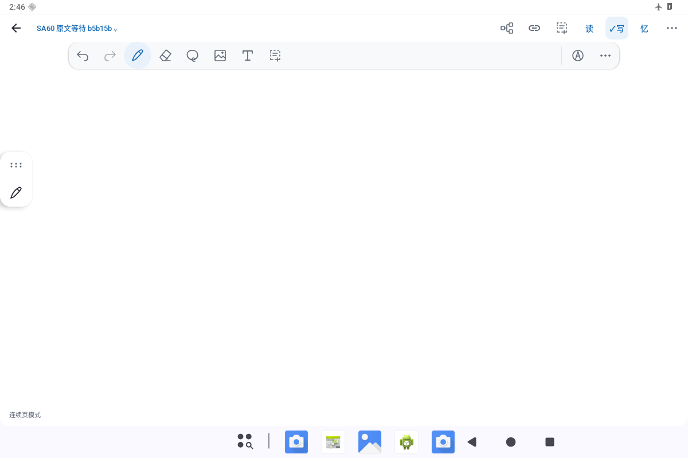
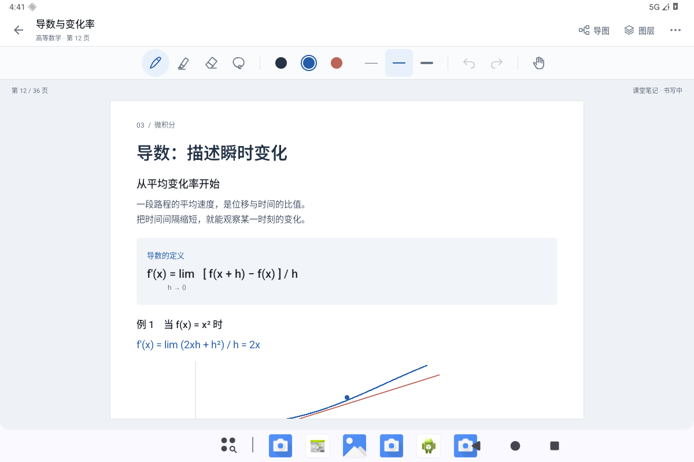
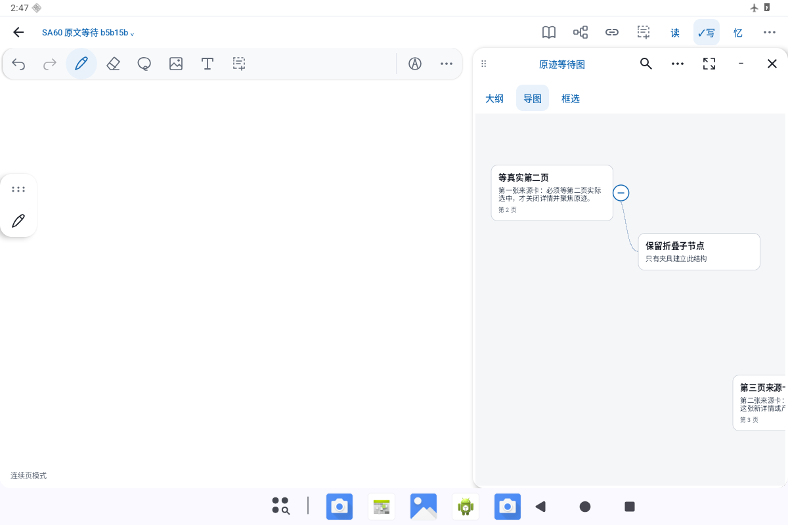
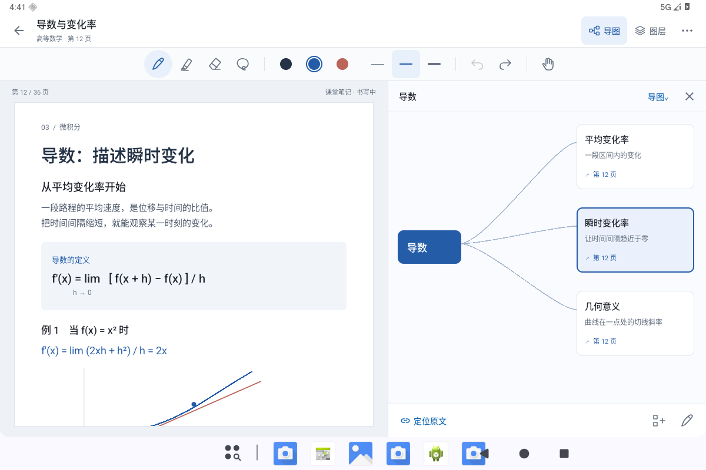
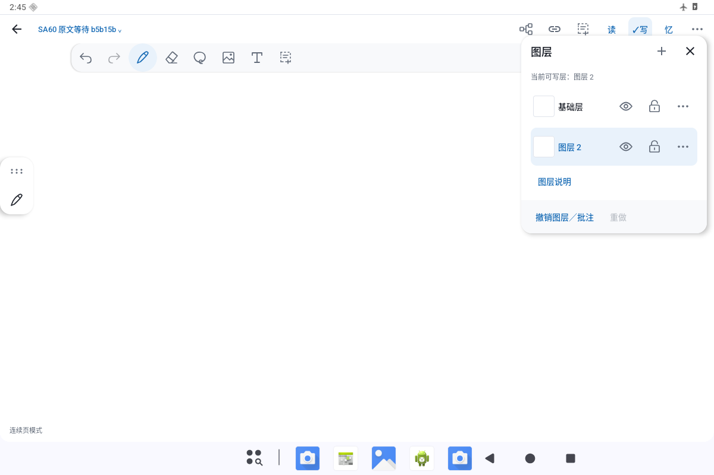
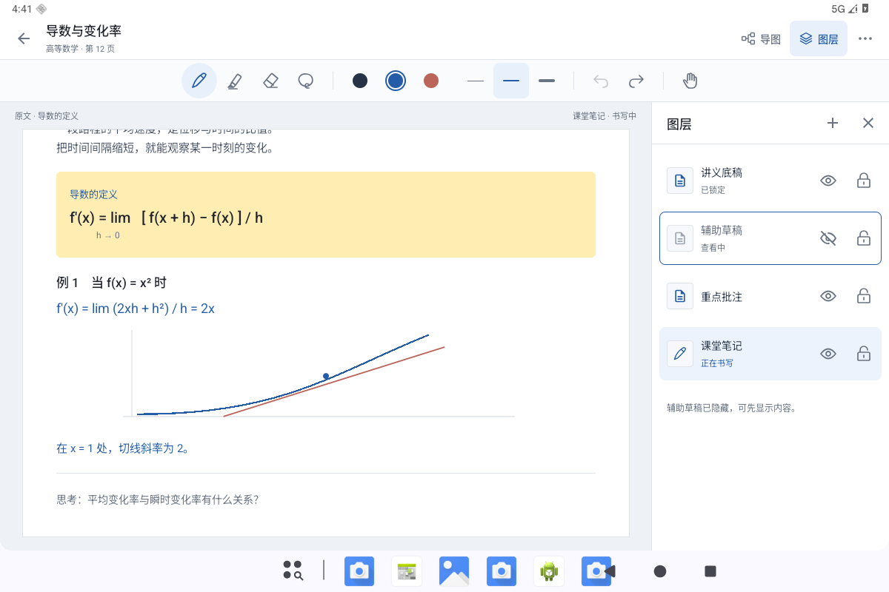

# 编辑页整页方案 · 待设计评审

本轮交付是**独立的 Android Compose Debug 原型**，不代表正式编辑器已经完成重设计。PR #17 继续保留草稿，待整页设计评审后再决定接入范围。先前功能回归通过与本轮外观、易用性验收分别记录。

基线为 `e9e096b6f64d9b36cf084d3d7ce99d063898bc22`，继续叠加于 PR #16 的 `ad0e982402edeb0b5d4bcc8ce453b317925f52fa`，未用旧 main 覆盖。所有新图均为云端 Android 模拟器上的原生 Compose 截图，内容为专门构造的数学讲义与本地临时笔迹；没有用户笔记。现状图是此前提供的 e9 整页截图，本轮为 artifact review，不冒充新的现状设备审计。

## 三个首要问题

1. **书写操作分散。** 文档动作、读写忆、960px 稀疏工具条、侧边笔柄同时出现；颜色与线宽离笔太远。新方案用固定导航行与集中工具行，常用颜色、线宽直接可见，再次点当前钢笔打开锚定属性面板。
2. **原文和导图互相遮挡。** 窄屏导图标题栏与动作托盘占掉内容，原文只剩细条。新方案宽屏 55:45 真分栏；竖屏默认 52:48 上下对照。节点动作占独立布局区域，不覆盖卡片。只有用户明确选择“原文”或“导图”才进入单视图。
3. **状态与动作混在一起。** 单字模式、视图标签、框选动作混排；图层重复说明与另一套撤销加重理解负担。新方案把图层作为有序侧面板：蓝色填充表示正在书写，边框表示正在查看，眼睛和锁单独表达显隐及锁定。图层撤销仅在发生图层操作后出现，明确命名“撤销上次图层操作”，不与笔迹历史合并。

## 参考选择与证据

| 参考 | 本轮采用的交互惯例 | 核看范围与来源 |
|---|---|---|
| Saber（主要开源书写参考） | 轻量文档导航、独立书写工具区、明显的当前笔与颜色；页面占主体 | 本云端实际打开官方仓库的手机和平板整页截图，并阅读 `toolbar.dart`、`color_bar.dart`。固定源码 `f143d84b46cb6faf795b13c00aee6d31f69e5da9`；[平板图](https://github.com/saber-notes/saber/blob/f143d84b46cb6faf795b13c00aee6d31f69e5da9/metadata/en-US/images/tenInchScreenshots/2_editor.png)、[工具源码](https://github.com/saber-notes/saber/blob/f143d84b46cb6faf795b13c00aee6d31f69e5da9/lib/components/toolbar/toolbar.dart)。 |
| Goodnotes | 点一下选择笔；再次点当前笔打开属性；颜色和笔宽紧邻工具；导航与书写区分开 | 本云端读取[官方笔工具说明](https://support.goodnotes.com/hc/en-us/articles/7353756785679-Write-and-customize-ink-with-the-Pen-tool)与[工具栏说明](https://support.goodnotes.com/hc/en-us/articles/8900755183631-Customize-the-toolbar)；父对话已实际核看官方图片。图中含不同版本及 Apple Pencil，不能当作 Android 实测。[属性图](https://support.goodnotes.com/hc/article_attachments/7436764047887)。 |
| MarginNote 4 | 原文与结构共享空间、明确比例；选中节点后定位来源；大纲与导图是视图，框选是动作；复习不占笔工具条 | 本云端读取[原文与导图联动](https://manual.marginnote.com.cn/mn4/en/mind-map-document-linked-view/)及[大纲显示](https://manual.marginnote.com.cn/mn4/en/outline-display-sorting/)。父对话已核看官方整页图；部分为 Mac/iPad，仅借组织原则。[官方联动图](https://manual.marginnote.com.cn/mn4/mind-map-document-linked-view/image/cca49cc9438cbb65.webp)。 |
| StarNote | 稳定书写条、临时属性浮层、原文旁的结构面板、图层显隐与锁定 | 本云端可读取[官网](https://starnote.ai/)，官网图及 Google Play 图下载返回 403；不声称本机操作过产品或看到了被拦图片。父对话已核看 `image-2` 与 `image-5` 并提供布局结论。[官方书写图](https://starnote.ai/images/image-2.png)。 |
| Butterfly（辅助开源面板参考） | 有序侧面板、工具的上下文属性、触屏可达的行操作 | 本云端实际打开官方仓库平板整页图，阅读 `app/lib/views/edit.dart` 和 `toolbar/view.dart`。固定源码 `5b4f303c8d5283688790a6f211545a4f9b3d730a`；[平板图](https://github.com/LinwoodDev/Butterfly/blob/5b4f303c8d5283688790a6f211545a4f9b3d730a/metadata/en-US/images/tenInchScreenshots/2-main.png)、[图层文档](https://butterfly.linwood.dev/docs/v2/layers/)。 |

Saber 仓库为 [GPL-3.0](https://github.com/saber-notes/saber/blob/f143d84b46cb6faf795b13c00aee6d31f69e5da9/LICENSE.md)；Butterfly 应用为 [AGPL-3.0](https://github.com/LinwoodDev/Butterfly/blob/5b4f303c8d5283688790a6f211545a4f9b3d730a/LICENSE)，其 README 另列图片/文档 CC-BY-SA-4.0 与 API Apache-2.0。这里采用布局与交互惯例，代码在现有 Compose 中独立编写，复用 InkWeft 现有图标，另在 Debug 中绘制荧光笔、移动手掌和图层三个矢量图标；未引入竞品框架、代码、品牌或闭源资产。

## 整页对照

图片保持整页，点击可查看原尺寸。竞品图为外链，不能加载时仍可从上表官方页面查看。现状与方案使用不同合成内容，比较的是布局，不是同一文档渲染精度。

| 现状：书写 | 参考：Saber 平板 | 方案：书写 |
|---|---|---|
|  |  |  |

| 现状：导图 | 参考：MarginNote 4 联动 | 方案：原文与导图 |
|---|---|---|
|  |  |  |

| 现状：图层 | 参考：Butterfly 侧面板 | 方案：图层 |
|---|---|---|
|  |  |  |

Butterfly 此整页参考图显示的是页面导航面板，图层行交互另见官方图层文档，不将页面列表误标成图层实图。

## 三条评审路径

1. **直接写笔记。** 打开页面 → 选笔/颜色/笔宽 → 写一笔 → 撤销。当前钢笔再点一次，仅打开临时属性面板；退出后工具位置不动。检查[书写整页](landscape-writing.png)与[属性面板](landscape-pen-properties.png)。
2. **边读原文边整理。** 点“导图” → 保留原文可读区域 → 选节点 → “定位原文” → 原文定位高亮 → 收起导图继续写。动作条不遮节点。[分栏整页](landscape-map.png)、[定位原文](landscape-map-source.png)、[竖屏上下对照](portrait-map.png)、[窄屏默认对照](narrow-map.png)。
3. **管理图层再继续写。** 点“图层” → 查看已隐藏的草稿（书写层不变）→ 选可写批注层 → 明确点“在重点批注上书写” → 收起面板 → 写入所选层。[图层整页](landscape-layers.png)、[竖屏图层](portrait-layers.png)、[恢复书写](landscape-resume-writing.png)。

## 原型边界

- 原型位于 `src/debug`，用例限定于 `src/androidTestDebug`，无桌面图标、无正式编辑器入口；用 instrumentation 启动未导出的 Activity。正式源码与存储、撤销、导图资料没有修改。
- 页面正文为 Compose 排版的合成讲义，临时笔迹由原生 Canvas 接收触摸绘制；不是生产 `InkCanvasView` 的性能或笔迹质量演示，也不代表 PDF 引擎验收。
- 图层使用现有 `UserLayers` 规则，但只在内存中运行；未替代持久化 authoring 路径。原型的笔迹撤销与图层撤销各自独立。
- 导图是用于比例、导航和选中反馈评审的合成树，可选节点、改标题、加同级要点和切换大纲；没有宣称完整层级拖放、资料追踪或复习系统已经接入。
- 页面列表、导出仍显示为不可用的次级菜单项，导航/导出不在这次三路径原型中。套索仅演示选中态，橡皮仅撤销当前层最近临时笔迹，正式行为待设计通过后接入现有实现。
- 本轮先审构图、阅读空间和操作顺序；原型用例通过不能替代用户的 UX 认可。批准布局后再接真实编辑状态、数据及各工作模式，并运行相关生产回归。

## 复现与检查

类：`org.inkweft.app.EditorDesignReviewTest`。测试会启动 Debug 原型并产生 `design-*.png`，覆盖横屏、竖屏、窄屏三路径。模拟器为云端软件渲染 Android API 36，非用户设备；不作延迟/性能结论。实际执行结果另见 `validation.json`。
