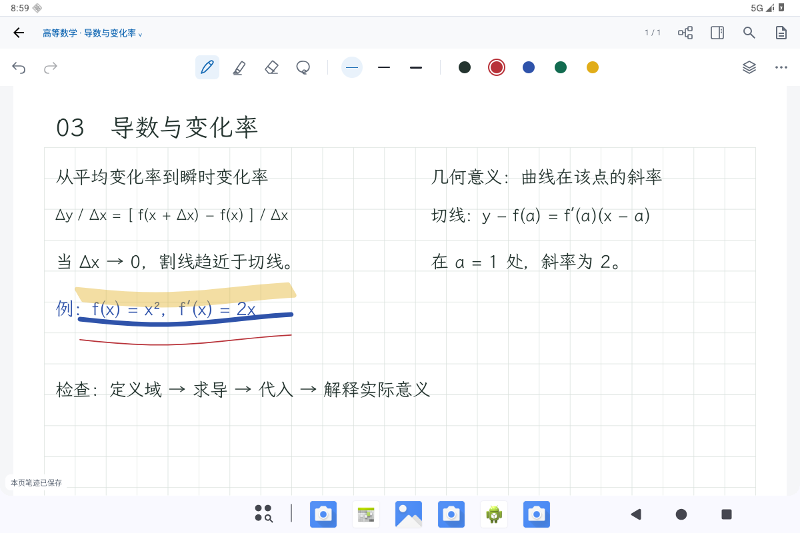

# 真实编辑器接线与验证

用户认可 `0219ca84` 横屏原型的视觉方向后，本轮将该方向接入正式 `MainActivity` / `InkPageScreen`。沿用现有笔迹、对象、图层、保存、撤销和来源导航实现，没有把原型 Canvas 当作笔记功能。基线为 `0219ca84d0355b1228056535e7daf60087d637aa`，保留 PR #16 的 `ad0e982402edeb0b5d4bcc8ce453b317925f52fa` 及后续成果；PR #17 继续为 Draft。

已接入 48dp 文档导航和 56dp 单行工具栏：撤销重做、笔、荧光笔、橡皮和套索使用统一图标及 48dp 目标。宽屏直接显示三档笔宽、五色预设；再次点击当前笔打开原有参数和笔种选择。默认浮动笔盒移除，文档操作用文档图标，工具扩展保留一个“更多工具”。收藏笔、胶带和字迹调整仍使用原有逻辑。

图层以蓝色区分当前可写层，以边框区分正在浏览的隐藏或锁定层；宽屏卡片从图层按钮下方展开，375dp 窄屏使用底部卡片。导图默认保留原文，窄屏新窗口位于下方且占用不超过可用高度的 58%；既有窗口偏好、显式全屏及来源返回状态继续沿用原实现。

| 状态 | 1200×800 / 字体 1.0 | 375×800 / 字体 1.6 |
| --- | --- | --- |
| 书写 | [横屏](production-writing-landscape.png) | [窄屏](production-writing-narrow-font16.png) |
| 图层 | [按钮下方卡片](production-layers-landscape.png) | [底部卡片](production-layers-narrow-font16.png) |
| 导图 | [原文与导图](production-map-landscape.png) | [保留原文区域](production-map-narrow-font16.png) |

截图来自 API 36 云端软件模拟器的真实编辑器，均为原始 PNG。示例文字是通过现有仓库保存的合成数学笔记，蓝、红和荧光笔迹来自真实原生画布上的模拟手写笔事件并已落库。测试通过原生视口按页宽取景；这些单页截图不代表连续页、来源跳转或真机性能已经完成全部验收。未使用真实用户笔记，也没有复制参考产品图片素材。

当前阶段：8 项原生界面回归通过，覆盖宽色切换只影响新笔迹、荧光透明度、撤销重做、面板反复开关、重建保持、48dp 目标以及窗口恢复/关闭边界。369 项核心测试通过；应用和数据层测试包构建成功，lint 无错误，签名校验通过，数据库 schema 未变化。完整数据与导航回归仍在运行，结果将补充至 [validation.json](validation.json)。

初次尝试保留为失败记录：一处测试文案完整匹配已改为子串匹配；窄屏系统配置切换后的 Compose 测试布局重入，补充 Activity 重建及资料库就绪等待后复测通过。未通过放宽笔迹或数据断言处理。

构建使用环境已有的外部 Gradle init 脚本，将无法直接访问的 MuPDF Maven 包替换为官方 1.28.5 源码构建的完整原生 AAR；仓库生产依赖声明未改。APK 和完整日志不公开发布。物理手写笔压感/延迟、真实平板分屏以及完整 instrumentation 全套：**NOT_RUN**。GitHub CI 不在本页宣称通过；自动工作流针对 `main`，本 Draft PR 仍叠在 PR #16 分支。
