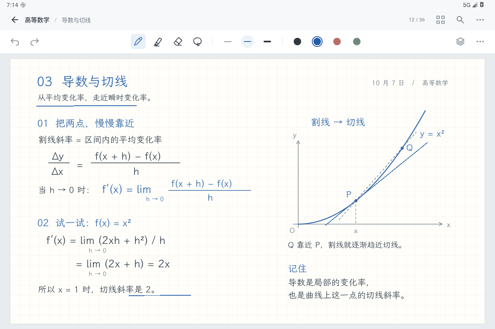

# 横屏书写单页 · 视觉方向已获认可

此前整页原型已被用户整体否定。本页记录随后交付的 1200×800 横屏 Debug 原型。用户已认可这次视觉方向（“这次改动比原来好了很多”），并授权继续接入真实编辑器；这不是全部功能验收。真实编辑器接线与验证另见 [生产界面验证](../production-editor-20261007/README.md)。PR #17 保持 Draft。

唯一主参考为 Goodnotes 官方 [Improved User Interface](https://support.goodnotes.com/hc/en-us/articles/13682253498767-Improved-User-Interface) 中的 [编辑器截图](https://support.goodnotes.com/hc/article_attachments/13919783257615)。该图由父侧独立视觉研究实际核看；本执行环境未取得图片像素，按父侧确认的文字设计规格实现原创布局，不宣称像素复刻。官方素材未复制进仓库，也没有混用其他产品的图像构图。

本页采用 48dp 文档导航、56dp 稳定工具栏；纸面取消旧原型 820dp 宽度上限，改为左右各 24dp、上下各 12dp 的有限边距。撤销重做在左侧，中央依次为四种书写工具、三档笔宽和四色预设，细线分组；图标保持 24dp、触控保持 48dp，工具选态底缩到 36dp；末端预留面板与更多入口。默认不显示导图、图层、复习或浮动笔柄。

纸面是自行编写的数学课堂笔记：复用已有文楷字体，以原生 Canvas 绘制正文、公式、网格与平方函数示意图。没有真实用户内容，没有使用参考图的素材。标题和重点使用同一蓝色，正文为墨色；保留常规书写密度和少量空白。

原型边界：可以选择工具、颜色、笔宽，画临时笔迹、撤销和重做，再点当前钢笔打开临时粗细设置。套索只展示选态，橡皮只移除最近临时笔迹；导航、搜索、面板与更多入口禁用，等待布局认可后接现有功能。内容没有存储或生产 authoring 接线。该 Debug Activity 收起 Android 导航栏以保留纸面，边缘滑动可临时唤回系统栏。当前只检查横屏、font scale 1.0，不扩展其他视口或模式，不作手写性能结论。

本轮用例为 `WritingStudyReviewTest.landscapeWritingCapture`。构建与最小原生运行结果见 [validation.json](validation.json)；这些结果不代表 UX 验收通过。[上一版截图与代码](../editor-design-review-20261007/README.md)保留用于对照。
